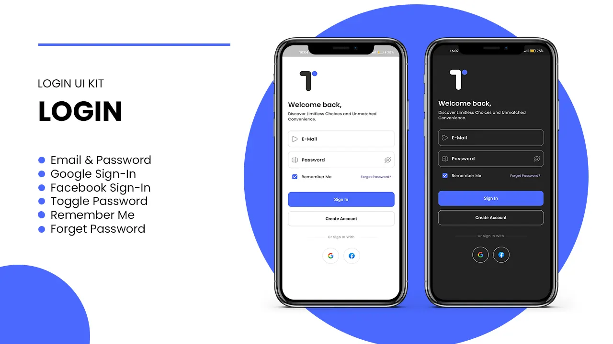
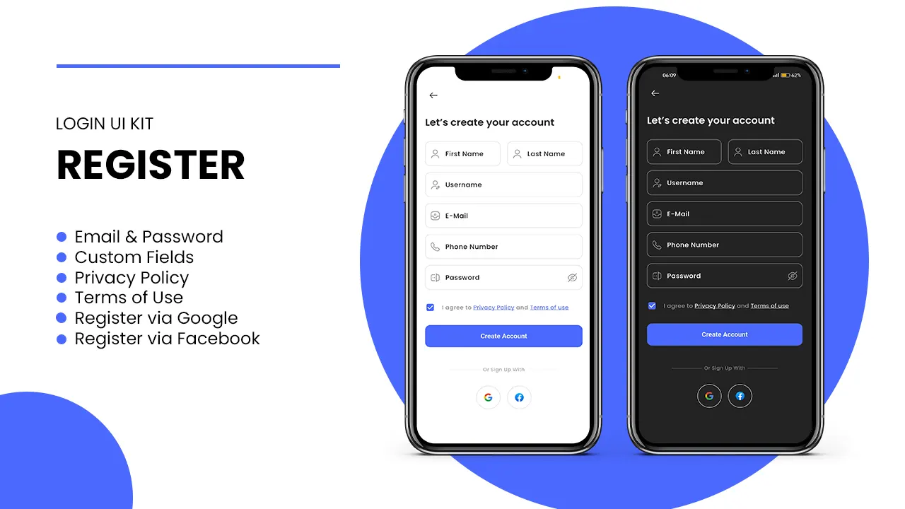
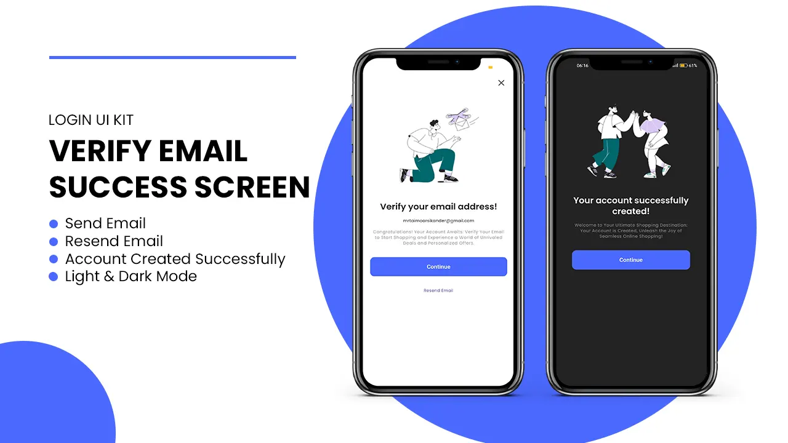
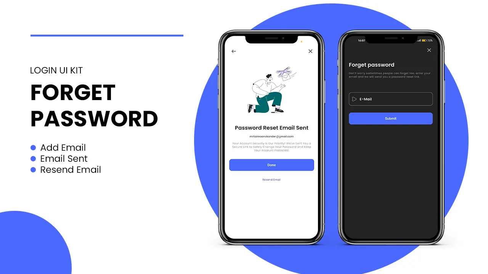
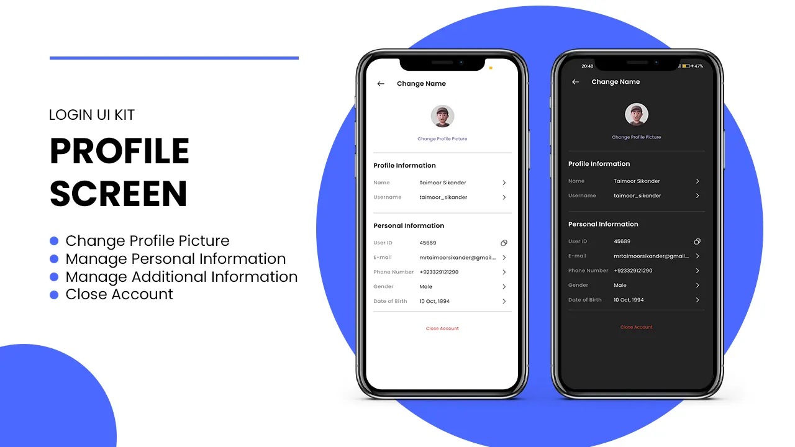

# **Authentication App**

[](LICENSE)  
[](https://github.com/your-username/repository-name/releases)








## 📱 **App Overview**

**Authentication App** is a Flutter-based mobile application that provides a secure way for users to log in, register, and manage their accounts. It includes features such as email verification, password reset, and social media login options (Google and Facebook). The app supports both dark mode and light mode for a better user experience.

## ✨ **Features**

- 🔐 **User Authentication** – Register and log in users securely.
- 📧 **Email Verification** – Verify user email addresses during the registration process.
- 🔑 **Password Reset** – Allow users to reset their passwords easily.
- 📱 **Social Login** – Enable users to log in with their Google or Facebook accounts.
- 🌙 **Dark Mode & Light Mode** – Switch between dark and light themes for user preference.
- 🔄 **Responsive UI** – Enjoy a seamless user experience across different screen sizes and orientations.

## 🛠 **Technologies Used**

- **Flutter (Dart)** – For building the app’s user interface and managing app logic.
- **Firebase** – For handling authentication services.

## 📦 **Packages Used**

- `provider`: ^6.1.2
- `firebase_core`: ^3.6.0
- `firebase_auth`: ^5.3.1
- `cloud_firestore`: ^5.4.3
- `google_sign_in`: ^6.2.1

## 🚀 **Getting Started**

### **Prerequisites**

- Flutter SDK: [Install Flutter](https://flutter.dev/docs/get-started/install)
- Dart 2.x or later
- Firebase account and project setup

### **Installation**

1. Clone the repository:

   ```bash
   git clone https://github.com/your-username/Authentication-App.git
   ```

2. Navigate into the project directory:

   ```bash
   cd Authentication-App
   ```

3. Install the required dependencies:

   ```bash
   flutter pub get
   ```

4. Set up Firebase and add your configuration files.

5. Run the app:

   ```bash
   flutter run
   ```

## 🤝 **Contributing**

We welcome contributions! If you would like to contribute, feel free to fork the repository and submit a pull request.

## 📝 **License**

This project is licensed under the MIT License – see the [LICENSE](LICENSE) file for details.

## Contact 📫

For any questions or feedback, feel free to reach out to me on [LinkedIn](https://linktr.ee/DineIssam).
